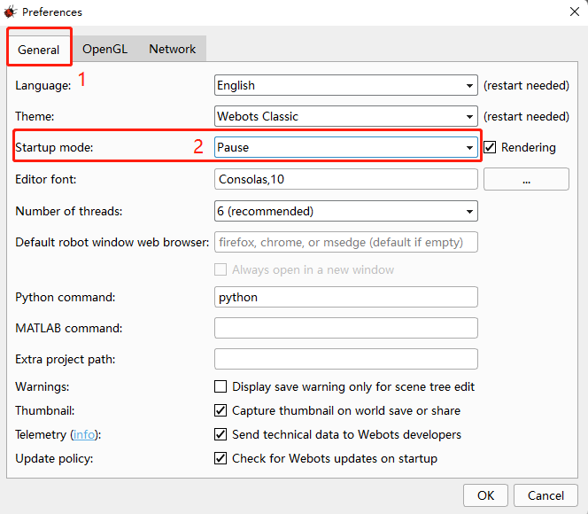

# MyCobot Webots

Webots is an open source multi-robot simulation platform for designing, testing and validating robot models, control algorithms and sensor interactions in a virtual environment

### Instructions for use

**Using the Python controller on a Windows-based system**

- Windows10 or Windows11
- Python3.9 or higher version

###  Webots Download

Click the link below to download and install

[webots-R2023b_setup.exe](https://github.com/cyberbotics/webots/releases/download/R2023b/webots-R2023b_setup.exe)

### Configure Webots

After the installation is complete, open the **Tools -> Preferences** module in the webots menu bar for simple settings, and set the **Startup mode** to **Pause** mode.



### Use mycobot_webots

- Use git to clone repository address, enter the command:

```bash
git clone https://github.com/elephantrobotics/mycobot_webots.git
```

- Load world file in webots

After opening **File -> Open World** in the Webots menu bar, select **mycobot_webots/mycobot_280_pi/worlds/mycobot_280_pi.wbt** file to load.